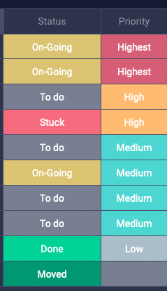
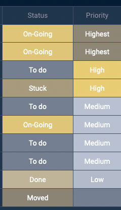
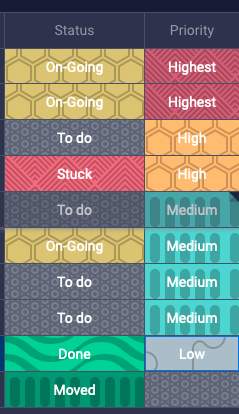
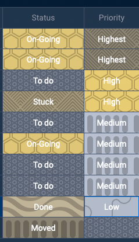

<h1 align="center">Cross Stitcher</h1>

 

Are you colourblind?

Do your Monday boards look like this?

| Normal                             | Colourblind (simulated)                                             |
|------------------------------------|---------------------------------------------------------------------|
|  |  |

What if they could look like this?

| Normal                                                | Colourblind (simulated)                                                                |
|-------------------------------------------------------|----------------------------------------------------------------------------------------|
|  |  |

Cross Stitcher is an addon for Firefox and Chrome that adds patterns to your Monday board status fields to make them easier to read for people with colourblindness.
